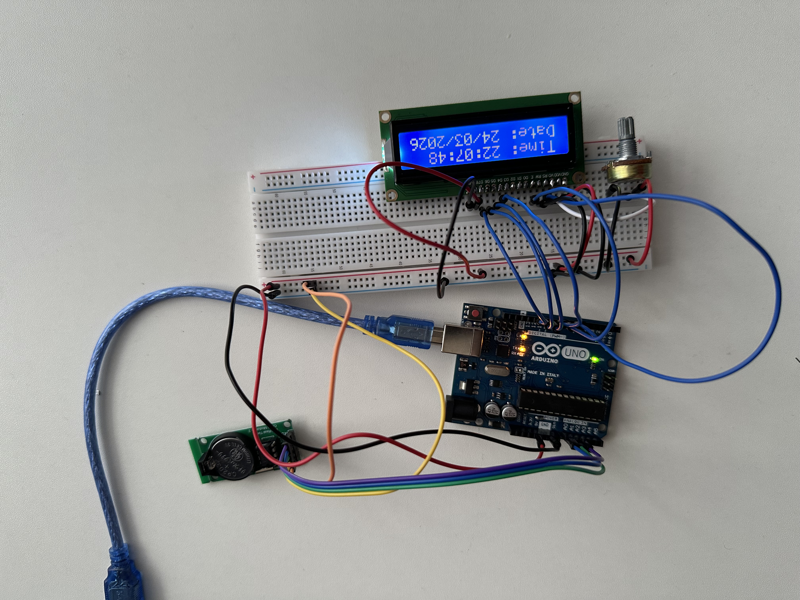

# RTC Clock Display

A real-time clock display built with an Arduino Uno and the DS1302 RTC module. It shows the current time and date on a 16x2 LCD screen — and keeps accurate time even when the Arduino is powered off, thanks to a coin cell battery on the RTC module.



## Features

- Displays live time (HH:MM:SS) on the LCD top row
- Displays live date (DD/MM/YYYY) on the LCD bottom row
- Keeps time when Arduino is powered off via onboard coin battery
- Serial Monitor output for debugging
- Updates every second

## Components

| Component | Quantity |
|-----------|----------|
| Arduino Uno | 1 |
| DS1302 RTC Module (MH-Real-Time Clock Modules-2) | 1 |
| 16x2 LCD Display | 1 |
| Potentiometer (10KΩ, for contrast) | 1 |
| Breadboard | 1 |
| Jumper Wires | Several |
| USB Cable (Type-B) | 1 |

## Wiring

### DS1302 RTC Module → Arduino

| RTC Pin | Arduino Pin |
|---------|-------------|
| CLK | A1 |
| DAT | A0 |
| RST | A2 |
| VCC | 5V |
| GND | GND |

### 16x2 LCD (4-bit mode) → Arduino

| LCD Pin | Arduino Pin |
|---------|-------------|
| RS | Digital Pin 7 |
| E | Digital Pin 8 |
| D4 | Digital Pin 9 |
| D5 | Digital Pin 10 |
| D6 | Digital Pin 11 |
| D7 | Digital Pin 12 |
| VSS | GND |
| VDD | 5V |
| V0 | Potentiometer wiper (contrast) |
| A (Backlight+) | 5V |
| K (Backlight-) | GND |

## Required Libraries

Install via the Arduino IDE Library Manager:

- **Ds1302** by Rafa Couto
- **LiquidCrystal** (built-in with Arduino IDE)

## How It Works

The DS1302 is a dedicated timekeeping chip with its own crystal oscillator (32.768 kHz) — the same frequency used in quartz wristwatches. This crystal vibrates at a precise rate, and the DS1302 counts those oscillations to track seconds, minutes, hours, days, months, and years. A small coin cell battery (CR2032) on the module keeps the chip powered and counting even when the Arduino is disconnected.

The Arduino communicates with the DS1302 over a simple 3-wire interface (CLK, DAT, RST) — not SPI or I2C, but a proprietary protocol. On startup, the sketch sets the initial time by writing a `DateTime` struct to the chip. After that, the main loop reads the current time from the RTC once per second and formats it onto the LCD: time on the top row (HH:MM:SS) and date on the bottom row (DD/MM/YYYY).

The `printTwoDigits()` helper function ensures single-digit numbers are zero-padded (e.g. `09` instead of `9`), keeping the display clean and aligned.

> **Note:** The initial time is hardcoded in `setup()`. After the first upload, you should comment out or remove the `rtc.setDateTime()` call and re-upload — otherwise the clock resets to the hardcoded time every time the Arduino restarts.

## Getting Started

1. Wire the components as described above
2. Open `rtc_clock_display.ino` in the Arduino IDE
3. Install the required libraries via **Sketch → Include Library → Manage Libraries**
4. Select **Arduino Uno** as the board and the correct COM port
5. Set the correct time and date in the `setup()` function
6. Upload the sketch
7. The LCD will display the current time and date
8. *(Optional)* Comment out the `rtc.setDateTime()` line and re-upload so the clock doesn't reset on power cycle

## Serial Monitor Output

Open the Serial Monitor at **9600 baud** to see time readings:

```
22:0:0
22:0:1
22:0:2
```

## License

This project is open source and available under the [MIT License](../LICENSE).
