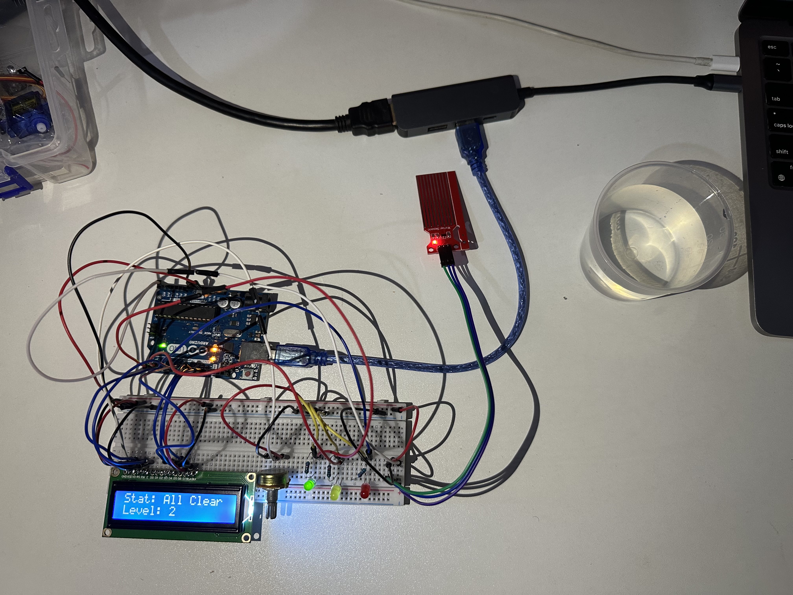
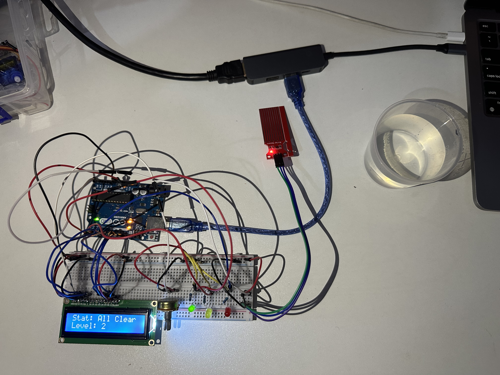

# Rain Alert System

A rain detection and alert system built with an Arduino Uno, a water level sensor, and a 16x2 LCD display. The system continuously monitors for water presence and provides three alert levels — all clear, light rain, and heavy rain — with corresponding LED indicators and real-time readings on the LCD.





## Features

- Real-time water level monitoring via analog sensor
- Three alert levels based on sensor threshold values
- Traffic-light LED feedback: green (clear), yellow (light rain), red (heavy rain)
- Live status and water level displayed on 16x2 LCD
- Serial Monitor output for debugging and data logging

## Components

| Component | Quantity |
|-----------|----------|
| Arduino Uno | 1 |
| Water Level Sensor | 1 |
| 16x2 LCD Display | 1 |
| Potentiometer (10KΩ, for contrast) | 1 |
| Green LED | 1 |
| Yellow LED | 1 |
| Red LED | 1 |
| 220Ω Resistors | 3 |
| Breadboard | 1 |
| Jumper Wires | Several |
| USB Cable (Type-B) | 1 |

## Wiring

### Water Sensor → Arduino

| Water Sensor Pin | Connect to |
|------------------|------------|
| + | 5V rail |
| - | GND rail |
| S (Signal) | Arduino A3 |

### 16x2 LCD → Arduino

| LCD Pin | Arduino Pin |
|---------|-------------|
| GND | GND rail |
| VDD | 5V rail |
| VO | Potentiometer middle pin |
| RS | Pin 7 |
| RW | GND rail |
| E | Pin 8 |
| D0–D3 | Leave empty |
| D4 | Pin 9 |
| D5 | Pin 10 |
| D6 | Pin 11 |
| D7 | Pin 12 |
| BLA | 5V rail |
| BLK | GND rail |

### LEDs → Arduino

| Component | Arduino Pin |
|-----------|-------------|
| Green LED long leg (+) | Digital Pin 3 |
| Yellow LED long leg (+) | Digital Pin 4 |
| Red LED long leg (+) | Digital Pin 5 |
| All short legs (-) | 220Ω resistor → GND |

## Required Libraries

Install via the Arduino IDE Library Manager:

- **LiquidCrystal** (built-in with Arduino IDE)

## How It Works

The water level sensor is a simple resistive sensor with exposed copper traces on a PCB. When water bridges the traces, it creates a conductive path — the more water covering the traces, the lower the resistance and the higher the analog voltage the Arduino reads on pin A3. The Arduino's analog-to-digital converter translates this voltage into a value between 0 (completely dry) and 1023 (fully submerged).

The sketch reads this value every 500 milliseconds and classifies it into three zones:

- **Below 300** — No water detected. The green LED lights up and the LCD shows "All Clear"
- **300 to 599** — Moderate water detected. The yellow LED lights up and the LCD shows "Light Rain"
- **600 and above** — Significant water detected. The red LED lights up and the LCD shows "Heavy Rain!"

The LCD displays the current status on the top row and the raw sensor value on the bottom row, giving you both a human-readable alert and the actual measurement. The same data is printed to the Serial Monitor for logging or plotting over time.

This traffic-light pattern — green, yellow, red — is the same approach used in industrial monitoring systems, flood warning stations, and environmental sensors, scaled down to a single breadboard.

## Getting Started

1. Wire the components as described above
2. Open `rain_alert_system.ino` in the Arduino IDE
3. Select **Arduino Uno** as the board and the correct COM port
4. Upload the sketch
5. The LCD will display "Rain Alert Ready" for 2 seconds, then begin monitoring
6. Touch the water sensor with a wet finger or dip it in water to trigger alerts

## Serial Monitor Output

Open the Serial Monitor at **9600 baud** to see readings:

```
Water level: 45
Water level: 52
Water level: 387
Water level: 642
```

## License

This project is open source and available under the [MIT License](../LICENSE).
