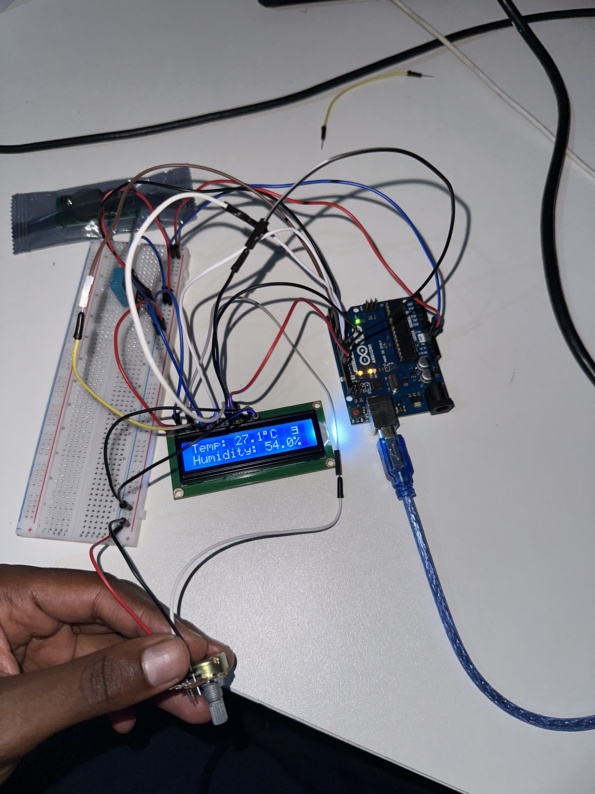

# Arduino Uno IoT Weather Station

A simple IoT weather station built with an Arduino Uno that reads temperature and humidity from a DHT11 sensor and displays the data on a 16x2 LCD screen.



## Features

- Real-time temperature reading in Celsius
- Real-time humidity percentage
- 16x2 LCD display with live updates every 2 seconds
- Serial Monitor output for debugging
- Sensor error detection with on-screen warning

## Components

| Component | Quantity |
|-----------|----------|
| Arduino Uno | 1 |
| DHT11 Temperature & Humidity Sensor | 1 |
| 16x2 LCD Display | 1 |
| Breadboard | 1 |
| Potentiometer (contrast adjust) | 1 |
| Jumper Wires | Several |
| USB Cable (Type-B) | 1 |

## Wiring

### DHT11 Sensor
| DHT11 Pin | Arduino Pin |
|-----------|-------------|
| DATA | Digital 2 |
| VCC | 5V |
| GND | GND |

### 16x2 LCD (4-bit mode)
| LCD Pin | Arduino Pin |
|---------|-------------|
| RS | Digital 7 |
| E | Digital 8 |
| D4 | Digital 9 |
| D5 | Digital 10 |
| D6 | Digital 11 |
| D7 | Digital 12 |
| VSS | GND |
| VDD | 5V |
| V0 | Potentiometer (contrast) |
| A (Backlight+) | 5V |
| K (Backlight-) | GND |

## Required Libraries

Install these via the Arduino IDE Library Manager:

- **DHT sensor library** by Adafruit
- **LiquidCrystal** (built-in with Arduino IDE)

## Getting Started

1. Wire the components as described above
2. Open `weather_station.ino` in the Arduino IDE
3. Install the required libraries
4. Select **Arduino Uno** as the board and the correct COM port
5. Upload the sketch
6. The LCD will show temperature (°C) and humidity (%)

## Serial Monitor

Open the Serial Monitor at **9600 baud** to see the readings printed for debugging:

```
Temp: 27.1°C  Humidity: 54.0%
```

## License

This project is open source and available under the [MIT License](LICENSE).
