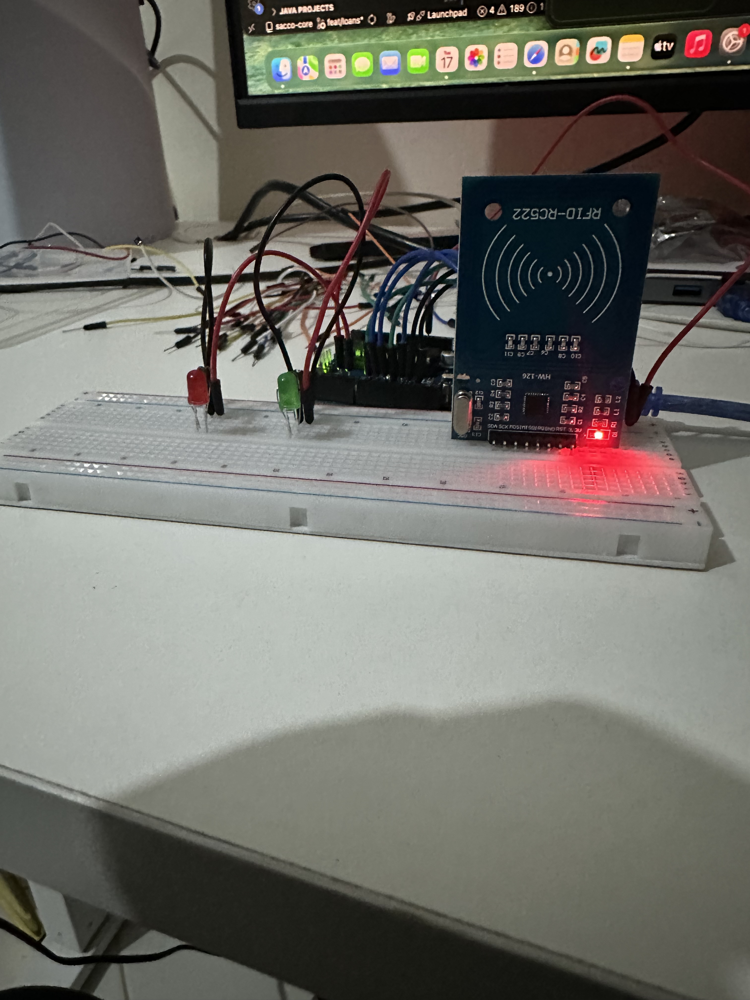
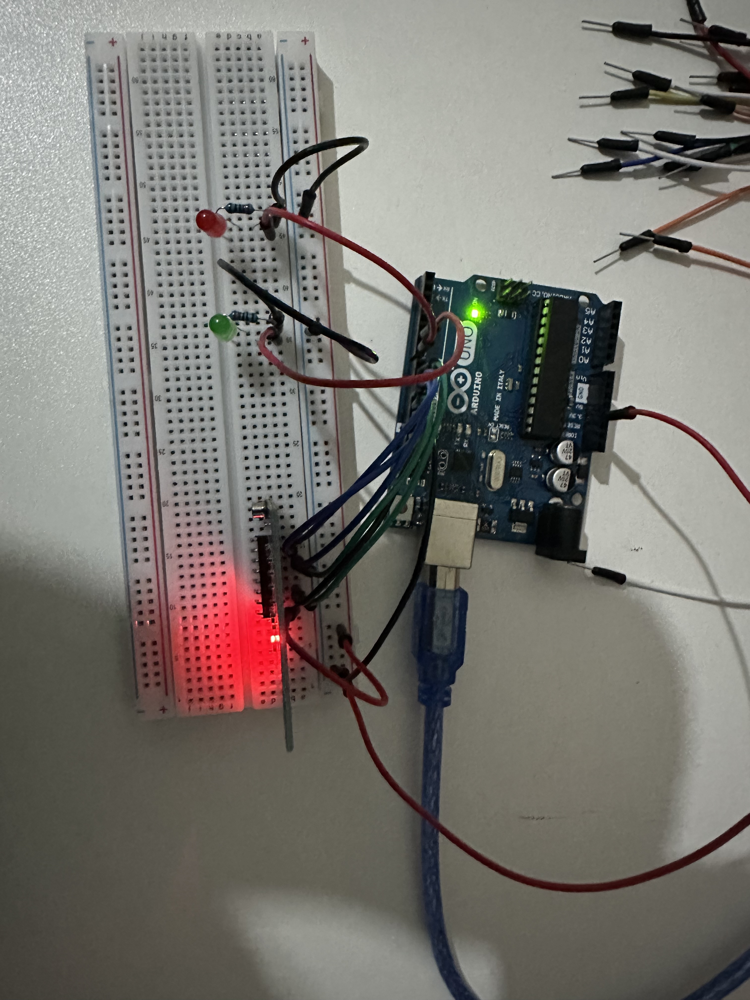

# RFID Door Lock

A contactless access control system built with an Arduino Uno and the RC522 RFID reader module. The system registers the first scanned card as the authorized credential, then grants or denies access for all subsequent scans — with LED feedback and Serial Monitor logging.

This is the same core technology behind office access cards, hotel room keys, contactless payment systems, and public transport cards — built from scratch on a breadboard.





https://github.com/user-attachments/assets/rfid-door-lock-demo.mp4

## Features

- Auto-registers the first RFID card scanned as the master credential
- Compares every subsequent scan against the stored UID
- Green LED for access granted, red LED for access denied
- All scan activity logged to Serial Monitor in real time
- Works with any MIFARE-compatible RFID card or key fob

## Components

| Component | Quantity |
|-----------|----------|
| Arduino Uno | 1 |
| MFRC522 RFID Reader Module | 1 |
| RFID Card or Key Fob (13.56 MHz) | 1+ |
| Green LED | 1 |
| Red LED | 1 |
| 220Ω Resistors | 2 |
| Breadboard | 1 |
| Jumper Wires | Several |
| USB Cable (Type-B) | 1 |

## Wiring

### RC522 → Arduino
| RC522 Pin | Wire Color Suggestion | Arduino Pin |
|-----------|-----------------------|-------------|
| SDA | Purple | Digital Pin 10 |
| SCK | Green | Digital Pin 13 |
| MOSI | Blue | Digital Pin 11 |
| MISO | Pink/White | Digital Pin 12 |
| IRQ | — | Leave empty |
| GND | Black | GND pin |
| RST | Orange | Digital Pin 9 |
| 3.3V | Red | 3.3V pin ⚠️ |

### LEDs → Arduino
| LED | Leg | Connect to |
|-----|-----|------------|
| Green LED | Long leg (+) | Digital Pin 6 |
| Green LED | Short leg (-) | 220Ω resistor → GND |
| Red LED | Long leg (+) | Digital Pin 7 |
| Red LED | Short leg (-) | 220Ω resistor → GND |

## Required Libraries

Install these via the Arduino IDE Library Manager:

- **MFRC522** by GithubCommunity
- **SPI** (built-in with Arduino IDE)

## Getting Started

1. Wire the components as described above
2. Open `RFID_Door_Lock.ino` in the Arduino IDE
3. Install the required libraries
4. Select **Arduino Uno** as the board and the correct COM port
5. Upload the sketch
6. Open the Serial Monitor at **9600 baud**
7. Scan your first card — it will be registered as the authorized credential
8. Scan again to test access granted / denied

## Serial Monitor

```
RFID Door Lock Ready!
Scan your card to register it...
Card UID: A3B2C1D0
Card REGISTERED as authorized!
Card UID: A3B2C1D0
ACCESS GRANTED!
Card UID: 1F2E3D4C
ACCESS DENIED!
```

## License

This project is open source and available under the [MIT License](LICENSE).
